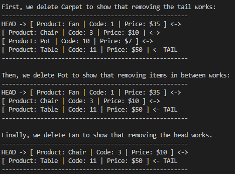

# DoublyLinkedList
A doubly linked list consisting of three classes: DoublyLinkedList, DoubleNode, and Product.  
Each node, except for the first and last, has a head pointer pointing to the previous node and a tail pointer pointing to the next node, as well as a Product object as the body/data. The head pointer for the first node is null, and the tail pointer for the last node is also null. Each time a new node is added, the DoublyLinkedList class insert it ascending order according to its product code. 

The implementation also includes error handling, such as displaying an error message if you attempt to use a product code that is already in use.
This app doesn't have a user interface, but you can check its console output below:

<h3>Console Output</h3>
Checking if adding prodcuts to the list works:
  

Then, check if deleting products from the list works:

